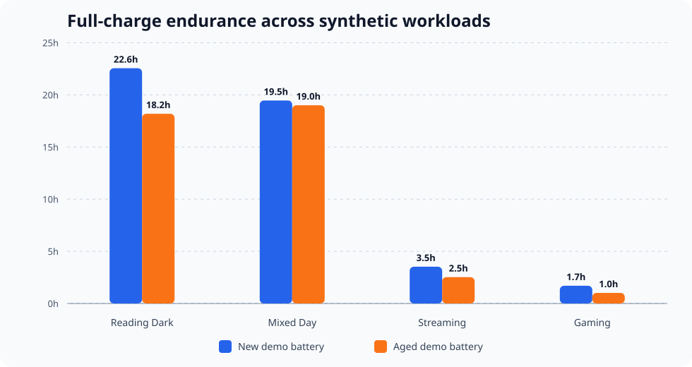
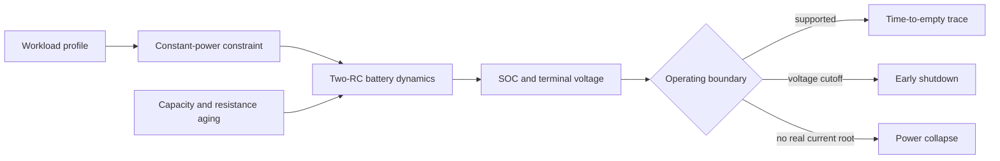

[简体中文](README.zh-CN.md)

# VoltCast

**Physics-informed smartphone endurance simulation, from workload to shutdown.**


Battery percentage is a state estimate, not an endurance guarantee. A phone at the same state of charge can last for hours under a light workload or cross its voltage cutoff quickly under sustained compute, display, and radio demand. Aging makes the gap larger by reducing usable capacity and increasing internal resistance.

VoltCast turns that gap into an inspectable systems model. It couples a continuous-time two-RC equivalent circuit with stepwise device workloads, solves the constant-power current constraint at every integration step, and reports both time-to-empty and the reason operation stopped.



> The chart uses transparent synthetic workloads and demonstration battery parameters. It shows model behavior, not measured performance of a commercial phone.

## Why this project exists

Many battery-life calculators divide nominal energy by average power. That shortcut hides the mechanisms that matter near shutdown:

- polarization makes terminal voltage depend on recent load history;
- constant-power electronics draw more current as voltage falls;
- higher resistance converts the same workload into more voltage sag;
- a workload schedule can matter even when average power is unchanged.

VoltCast preserves those interactions in a small, auditable model. It is intended for reproducible research, power-policy prototyping, architecture exploration, and teaching—not as a production fuel gauge.

## Model stack



The core is deliberately explicit:

1. A CSV profile supplies device power as a zero-order-hold signal.
2. The model solves `P = V_terminal * I` for the stable current root.
3. RK4 integration advances SOC plus fast and slow polarization states.
4. Simulation stops at depletion, voltage cutoff, infeasible power demand, or a configured time limit.

See [the model reference](docs/model.md) for equations and assumptions.

## Quick start

VoltCast has no runtime dependencies beyond Python 3.10+.

```bash
python3 -m venv .venv
source .venv/bin/activate
python -m pip install -e .

voltcast simulate scenarios/gaming.csv \
  --initial-soc 0.75 \
  --output artifacts/gaming-trace.csv
```

Compare all bundled workloads across several initial charge levels:

```bash
voltcast compare \
  scenarios/reading-dark.csv \
  scenarios/mixed-day.csv \
  scenarios/streaming.csv \
  scenarios/gaming.csv \
  --output artifacts/comparison.csv
```

Apply the documented demonstration aging transform:

```bash
voltcast compare scenarios/*.csv --aged
```

## Baseline snapshot

Using the bundled demonstration calibration at 100% initial SOC:

| Synthetic workload | New demo battery | Aged demo battery |
|---|---:|---:|
| Dark reading | 22.6 h | 18.2 h |
| Mixed day | 19.5 h | 19.0 h |
| Streaming | 3.5 h | 2.5 h |
| Gaming | 1.7 h | 1.0 h |

These results are committed as reproducibility fixtures in `artifacts/baseline/`. The strongest conclusion is structural, not device-specific: sustained power and resistance growth jointly compress the usable low-SOC region.

## Repository map

```text
src/voltcast/          dependency-free model and CLI
scenarios/             synthetic, human-readable workload profiles
configs/               demonstration battery calibration
artifacts/baseline/    versioned comparison outputs
scripts/               reproducible presentation tooling
tests/                 model, profile, and CLI invariants
docs/                  equations, evidence boundaries, and references
```

## Research and engineering boundaries

- Default parameters are illustrative and intentionally easy to replace.
- Bundled scenarios are synthetic, not traces collected from a named device.
- VoltCast does not claim hardware validation, production SOC estimation, or safety certification.
- The model is useful because every assumption is visible; calibration quality still determines predictive accuracy.

Read [Reproducibility and evidence](docs/reproducibility.md) before citing a numerical result.

## Contributing

New battery calibrations, measured open-license workload traces, alternative OCV curves, and uncertainty propagation are welcome. Contributions must document units, provenance, and the claim a test or dataset supports. See [CONTRIBUTING.md](CONTRIBUTING.md).

VoltCast preserves the real three-person research collaboration behind the model while separating it from the later open-source rewrite. See [Contributors](CONTRIBUTORS.md) and [Project lineage](docs/project-lineage.md) for roles, evidence, and the history-cleaning boundary.

## License and origin

Original code and documentation are available under the [MIT License](LICENSE). The research question was inspired by a public smartphone battery modeling brief; the official prompt and third-party papers are intentionally not redistributed. See [NOTICE](NOTICE) and [references](docs/references.md).
