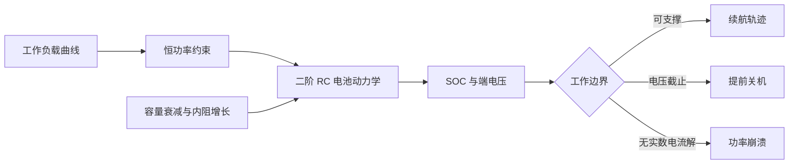

[English](README.md)

# VoltCast

**从工作负载到关机边界的、由物理机制驱动的智能手机续航模拟器。**


电量百分比只是状态估计，并不是续航保证。同样的 SOC，在轻负载下可能还能使用数小时，在持续计算、亮屏和网络负载下却可能很快触及电压截止线。电池老化还会同时减少可用容量、增加内阻，使这个差距进一步扩大。

VoltCast 把这个问题变成可检查、可复现的系统模型：它将连续时间二阶 RC 等效电路与分段设备负载耦合，在每个积分步求解恒功率电流约束，并同时报告剩余使用时间以及终止原因。


> 图中使用公开透明的合成负载与演示参数，用于展示模型行为，不代表任何商业手机的实测性能。

## 为什么需要 VoltCast

许多续航计算器只是用标称能量除以平均功率。这会隐藏临近关机时真正重要的机制：

- 极化效应让端电压依赖近期负载历史；
- 恒功率电子系统会在电压下降时提高电流；
- 内阻增长会让相同负载产生更大的压降；
- 即使平均功率相同，不同的负载时间编排也可能产生不同结果。

VoltCast 用一个小而透明的模型保留这些相互作用，适用于可复现实验、节能策略原型、系统架构分析和教学；它不是生产级电量计。

## 模型链路



核心过程保持显式：

1. CSV 文件以零阶保持方式给出设备功率；
2. 模型求解 `P = V_terminal * I` 的稳定电流根；
3. RK4 积分推进 SOC、快速极化和慢速极化状态；
4. 电量耗尽、端电压越界、负载不可支撑或达到时间上限时停止。

方程和假设见[模型说明](docs/model.md)。

## 快速开始

VoltCast 除 Python 3.10+ 外没有运行时依赖：

```bash
python3 -m venv .venv
source .venv/bin/activate
python -m pip install -e .

voltcast simulate scenarios/gaming.csv \
  --initial-soc 0.75 \
  --output artifacts/gaming-trace.csv
```

比较全部内置场景和多个初始电量：

```bash
voltcast compare \
  scenarios/reading-dark.csv \
  scenarios/mixed-day.csv \
  scenarios/streaming.csv \
  scenarios/gaming.csv \
  --output artifacts/comparison.csv
```

应用文档中说明的演示性老化变换：

```bash
voltcast compare scenarios/*.csv --aged
```

## 基线结果

使用内置演示参数、初始 SOC 为 100%：

| 合成负载 | 新电池演示模型 | 老化电池演示模型 |
|---|---:|---:|
| 深色阅读 | 22.6 小时 | 18.2 小时 |
| 混合日常使用 | 19.5 小时 | 19.0 小时 |
| 视频流 | 3.5 小时 | 2.5 小时 |
| 游戏 | 1.7 小时 | 1.0 小时 |

这些结果作为可复现基线保存在 `artifacts/baseline/`。真正有意义的是结构性结论，而不是把演示数字当成某款手机的预测：持续高功率与内阻增长会共同压缩低 SOC 区域的可用能量。

## 仓库结构

```text
src/voltcast/          零依赖模型和命令行工具
scenarios/             透明、可读的合成负载场景
configs/               演示电池参数
artifacts/baseline/    版本化基线输出
scripts/               可复现的展示生成工具
tests/                 模型、场景和 CLI 不变量测试
docs/                  方程、证据边界和参考资料
```

## 研究边界

- 默认参数只用于演示，设计上允许替换；
- 内置场景是合成输入，不是某款设备的采集轨迹；
- 项目不声称已经完成硬件验证、生产级 SOC 估计或安全认证；
- 模型的价值在于所有假设均可见，预测质量仍然取决于校准质量。

引用数值前请阅读[可复现性与证据边界](docs/reproducibility.md)。

## 参与贡献

欢迎提交新的电池校准、开放许可的实测负载、其他 OCV 曲线和不确定性分析。贡献必须说明单位、数据来源以及测试或数据能够支持的具体结论。详见 [CONTRIBUTING.md](CONTRIBUTING.md)。

VoltCast 保留了模型背后真实的三人研究协作，同时把这段研究基础与后续开源重构清楚分开。分工证据与历史清理边界见 [贡献者说明](CONTRIBUTORS.md) 和 [项目沿革](docs/project-lineage.md)。

## 许可与来源

原创代码与文档采用 [MIT License](LICENSE)。研究问题受到一份公开的智能手机电池建模任务启发，但仓库不重新分发官方题面和第三方论文。详见 [NOTICE](NOTICE) 与[参考资料](docs/references.md)。
